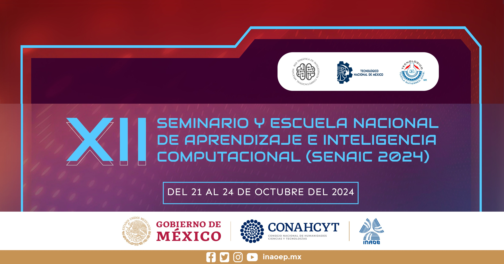

# Aplicación de Transformers en Computación Afectiva ♥️

Este repositorio contiene los ejercicios prácticos desarrollados durante el taller de "Aplicación de Transformers en Computación Afectiva" como parte del programa del Seminario y Escuela Nacional de Aprendizaje e Inteligencia Computacional realizado del 21 al 24 de octubre del 2024.

## Resumen del Taller

Primeramente iniciamos con una introducción a lo que es la computación afectiva, enfocándonos al reconocimiento de personalidad por medio del texto. Después abordamos lo que son los transformers dentro del aprendizaje profundo. En seguida, analizamos los principales modelos basados en transformers como lo son BERT, RoBERTa, BETO y GPT. Para terminar revisando código de aplicaciones y herramientas para crear un corpus para reconocimiento automático de personalidad, entrenamiento de modelos de aprendizaje con base en Transformers para clasificar personalidad y un ejemplo de reconocimiento de personalidad dentro de una aplicación educativa.

## Instructores

- Dr. Ramón Zatarain Cabada
- MCC Víctor Manuel Bátiz Beltrán

## Índice

Abrir índice usando **Google Colab**: 

## Otros sitios de interés:

[SENAIC 2024](https://ccc.inaoep.mx/SENAIC/)

[Google Colab](http://colab.research.google.com)

[Biblioteca SimpleTransformers](https://simpletransformers.ai/)

[Hugging Face Learn](https://huggingface.co/learn)

[TensorFlow Playground](https://playground.tensorflow.org)

[Kaggle Learn](https://www.kaggle.com/learn)

## Referencias

El trabajo presentado en este repositorio se basa en nuestras investigaciones contenidas en los siguientes artículos. Si alguna parte del repositorio te es útil para tus investigaciones favor de realizar la cita utilizando la referencia correspondiente:

### Corpus SentiText y Corpus EduSERE
Barrón Estrada, M. L., Zatarain Cabada, R., Oramas Bustillos, R., & Graff, M. (2020). Opinion mining and emotion recognition applied to learning environments. Expert Systems with Applications, 150, 113265. https://doi.org/10.1016/j.eswa.2020.113265

Zatarain Cabada, R., Barrón Estrada, M. L., Bátiz Beltrán, V. M. (2023). Advanced Applications of Generative AI and Natural Language Processing Models (Chapter 15). Deep Learning Approaches for Affective Computing in Text (pages 306-339). DOI: 10.4018/979-8-3693-0502-7.ch015.

### Corpus PersonText
Bátiz Beltrán, V. M., Zatarain Cabada, R., & Barrón Estrada, M. L. (2024). Creation of a Corpus in Spanish for the recognition of personality traits. Computación y Sistemas, Volumen 28, No. 3, 2024. ISSN: 2007-9737. Disponible en línea: https://cys.cic.ipn.mx/ojs/index.php/CyS/article/view/4619/3734