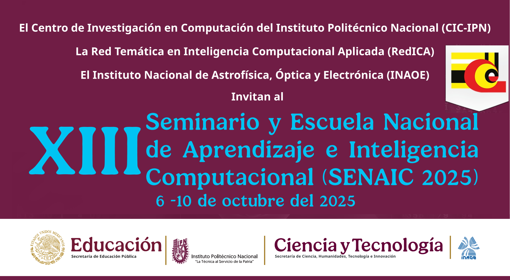

# IA Generativa Aplicada a la Computación Afectiva ♥️

Este repositorio contiene los ejercicios prácticos desarrollados durante el taller de "IA Generativa Aplicada a la Computación Afectiva" como parte del programa del Seminario y Escuela Nacional de Aprendizaje e Inteligencia Computacional realizado del 6 al 10 de octubre del 2025.

## Resumen del Taller

Primeramente se abordarán temas teóricos relacionados con la IA Generativa y la Computación Afectiva como son los transformers, los LLM, el Reconocimiento Automático de Emociones y Personalidad. Posteriormente se presentarán ejemplos Python con sus respectivas bibliotecas en donde por medio de diferentes técnicas de IA Generativa podemos incrementar y balancear un corpus para
reconocimiento de personalidad mejorando así las métricas de clasificación entre otros ejemplos.

## Instructores

- Dr. Ramón Zatarain Cabada
- Dr. Víctor Manuel Bátiz Beltrán

## Índice

Abrir índice usando **Google Colab**: 

## Otros sitios de interés:

[SENAIC 2025](https://ccc.inaoep.mx/SENAIC/)

[Google Colab](http://colab.research.google.com)

[Biblioteca SimpleTransformers](https://simpletransformers.ai/)

[Hugging Face Learn](https://huggingface.co/learn)

[TensorFlow Playground](https://playground.tensorflow.org)

[Kaggle Learn](https://www.kaggle.com/learn)

## Referencias

El trabajo presentado en este repositorio se basa en nuestras investigaciones contenidas en los siguientes artículos. Si alguna parte del repositorio te es útil para tus investigaciones favor de realizar la cita utilizando la referencia correspondiente:

### IA Generativa para reconocimiento automático de la personalidad
Zatarain Cabada, R., Barrón Estrada, M. L., González Robles, A., Bátiz Beltrán, V. M., & Graff M. (2025). Generative AI for Automatic Personality Recognition. In: Martínez-Villaseñor, L., Martínez-Seis, B., Pichardo, O. (eds) Artificial Intelligence – COMIA 2025. COMIA 2025. Communications in Computer and Information Science, vol 2552. Springer, Cham. https://doi.org/10.1007/978-3-031-97907-1_7

### Corpus SentiText y Corpus EduSERE
Barrón Estrada, M. L., Zatarain Cabada, R., Oramas Bustillos, R., & Graff, M. (2020). Opinion mining and emotion recognition applied to learning environments. Expert Systems with Applications, 150, 113265. https://doi.org/10.1016/j.eswa.2020.113265

Zatarain Cabada, R., Barrón Estrada, M. L., Bátiz Beltrán, V. M. (2023). Advanced Applications of Generative AI and Natural Language Processing Models (Chapter 15). Deep Learning Approaches for Affective Computing in Text (pages 306-339). DOI: https://10.4018/979-8-3693-0502-7.ch015.

### Corpus PersonText
Bátiz Beltrán, V. M., Zatarain Cabada, R., & Barrón Estrada, M. L. (2024). Creation of a Corpus in Spanish for the recognition of personality traits. Computación y Sistemas, Volumen 28, No. 3, 2024. ISSN: 2007-9737. Disponible en línea: https://cys.cic.ipn.mx/ojs/index.php/CyS/article/view/4619/3734